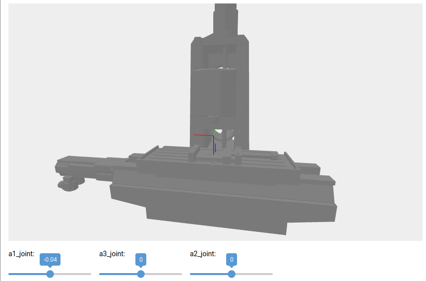

# urdf_scene_nicegui: 3D Animation of URDF Files in NiceGUI Scenes

`urdf_scene_nicegui` is a minimal Python3 package to load [URDF files](http://wiki.ros.org/urdf) in the awesome UI framweork [NiceGUI](https://github.com/zauberzeug/nicegui/) for web-based UIs in Python. This allows to quickly visualize robots and machine tools in NiceGUI and even animate them (e.g., sync with real axis values from machine).



Besides `nicegui`, the only external dependency is [`urchin`](https://github.com/fishbotics/urchin) (a maintained fork of [urdfpy](https://urdfpy.readthedocs.io/en/latest/)) for easier loading the URDFs (Could probably be replaced by native XML parsing). Feel free to inspect the `requirements.txt` file.

## Howto

### Install

Due to its early developing stage it is not on pypi. You have to install it manually:

```sh
# Directly install from github:
pip install git+https://github.com/chhinze/urdf_scene_nicegui.git@main


# Alternative: Clone the repository, then install:
# on some platforms you have to call pip3 instead
pip install .

# if you want to modify the source after installing
pip install -e .

```


### Use it in your project

```py
# minimal example

from nicegui import ui
scene = UrdfScene(os.path.join(script_dir, "path/to/your.urdf"))
scene.show(material="#888", scale_stls=1)
ui.run()

```

Or see `examples/` folder.


## Roadmap:

- [x] Implement basic functionality
- [x] Add coordinate systems at end links
- [x] Make meshes scalable
- [x] Implement axis animation (recursive `with scene.group()`)
- [x] Retreive axes limits
- [ ] Support additional mesh formats (needs nicegui extensions or on-the-fly conversion)
- [ ] Respect colors/transparencies
- [ ] Support more joint types (e.g. free joint for mobile robotics)